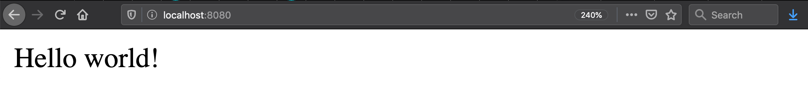

# slim-php-docker-heroku-mariadb
[](https://travis-ci.org/jonashackt/slim-php-docker-heroku-mariadb)
[](https://slim-php-docker-heroku-mariadb.herokuapp.com:8080)

Example project showing how to run a Slim framework based PHP app in Docker locally &amp; on Heroku incl. connection to MariaDB


### Prerequisites

Install the PHP dependency management solution [composer](https://getcomposer.org/):

```
brew install composer
```

### PHP without a clue - how to start

I have to admit, I've never done PHP before. But my students have to, so I need to know what they are talking about. Let's choose a decent PHP webframework like [Slim](https://github.com/slimphp/Slim), which look really nice and easy to start with!

Let's start with PHP and Slim by creating a new app with the help of a skeleton:

```bash
php composer.phar create-project slim/slim-skeleton slim-php-docker-heroku-mariadb
```

Now slim skeleton prepares everything for us: TravisCI config, Docker Compose file, coveralls configuration, composer files, phpunit configuration, tests and application code... Wow!

To run the application in development, you can run these commands 

```bash
composer start

# Or you can use `docker-compose`:
docker-compose up -d
```

After that, open `http://localhost:8080` in your browser:



Run the test suite locally:

```bash
composer test
```

### Run PHP build with composer on TravisCI

This one is simple, since the Slim skeleton generates us most of the Travis config already. Just activate the build settings on Travis for this project at [https://travis-ci.org/](https://travis-ci.org/) and have a look into the [.travis.yml] (.travis.yml):

```yaml
language: php

dist: trusty

matrix:
  include:
  - php: 7.1
  - php: 7.2
  - php: 7.3
  - php: nightly

  allow_failures:
  - php: nightly

before_script:
- composer require php-coveralls/php-coveralls:^2.1.0
- composer install -n

script:
- vendor/bin/phpunit --coverage-clover clover.xml

after_success:
- vendor/bin/php-coveralls --coverage_clover=clover.xml -v
```

This will create 3 parallel Travis builds - where all of them install all dependencies with composer and run the phpunit tests. Also a converalls report will be created.


### Run Slim PHP on Heroku

Having a look at https://devcenter.heroku.com/articles/deploying-php, this should be also simple!

First add a [Profile](Procfile):

```
web: vendor/bin/heroku-php-apache2 public/
```

Since Slim serves the HTML/CSS/JavaScript from the `public` directory, we need to [set it as a document root](https://devcenter.heroku.com/articles/deploying-php#configuring-the-document-root).

Now assuming you already created your Heroku account and installed `heroku CLI` (e.g. via `brew install heroku`), let's create a Heroku PHP app:

```
heroku create
```