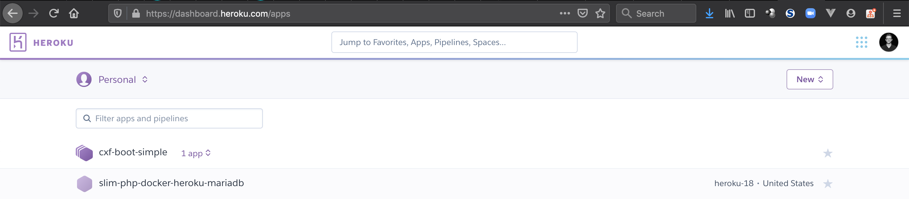
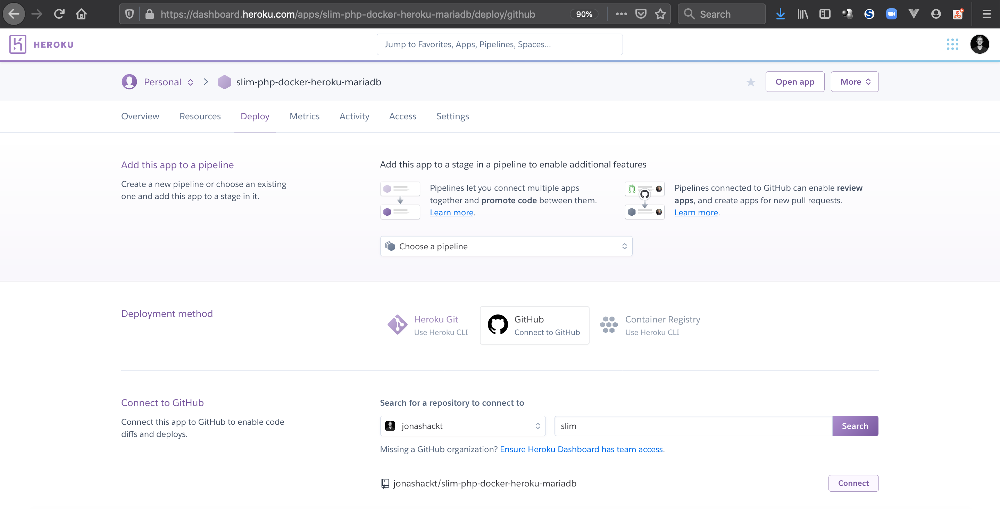
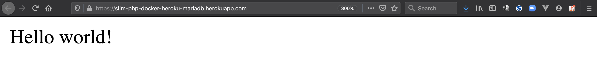
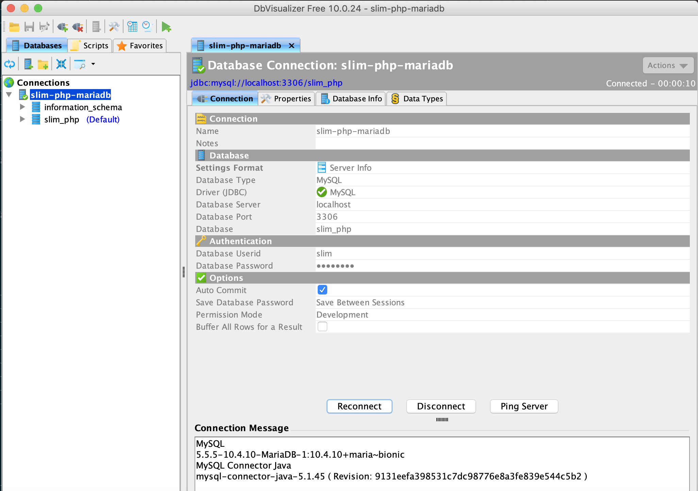
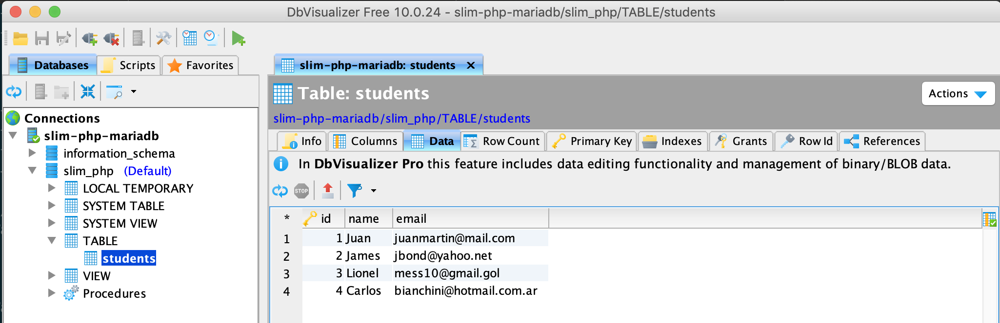

# slim-php-docker-heroku-mariadb
[](https://travis-ci.org/jonashackt/slim-php-docker-heroku-mariadb)
[](https://github.com/jonashackt/slim-php-docker-heroku-mariadb/blob/master/LICENSE)
[](https://renovatebot.com)
[](https://slim-php-docker-heroku-mariadb.herokuapp.com)

Example project showing how to run a Slim framework based PHP app in Docker locally &amp; on Heroku incl. connection to MariaDB


# Prerequisites

Install the PHP dependency management solution [composer](https://getcomposer.org/):

```
brew install composer
```

# PHP without a clue - how to start

I have to admit, I've never done PHP before. But my students have to, so I need to know what they are talking about. Let's choose a decent PHP webframework like [Slim](https://github.com/slimphp/Slim), which look really nice and easy to start with!

Let's start with PHP and Slim by creating a new app with the help of a skeleton:

```bash
php composer.phar create-project slim/slim-skeleton slim-php-docker-heroku-mariadb
```

Now slim skeleton prepares everything for us: TravisCI config, Docker Compose file, coveralls configuration, composer files, phpunit configuration, tests and application code... Wow!

To run the application in development, you can run these commands 

```bash
composer start

# Or you can use `docker-compose`:
docker-compose up -d
```

After that, open `http://localhost:8080` in your browser:


Run the test suite locally:

```bash
composer test
```

# Run PHP build with composer on TravisCI

This one is simple, since the Slim skeleton generates us most of the Travis config already. Just activate the build settings on Travis for this project at [https://travis-ci.org/](https://travis-ci.org/) and have a look into the [.travis.yml] (.travis.yml):

```yaml
language: php

dist: trusty

matrix:
  include:
  - php: 7.1
  - php: 7.2
  - php: 7.3
  - php: nightly

  allow_failures:
  - php: nightly

before_script:
- composer require php-coveralls/php-coveralls:^2.1.0
- composer install -n

script:
- vendor/bin/phpunit --coverage-clover clover.xml

after_success:
- vendor/bin/php-coveralls --coverage_clover=clover.xml -v
```

This will create 3 parallel Travis builds - where all of them install all dependencies with composer and run the phpunit tests. Also a converalls report will be created.


# Run Slim PHP on Heroku

Having a look at https://devcenter.heroku.com/articles/deploying-php, this should be also simple!

First add a [Profile](Procfile):

```
web: vendor/bin/heroku-php-apache2 public/
```

Here we can choose from 2 possible webservers: `heroku-php-apache2` or `heroku-php-nginx`.

Since Slim serves the HTML/CSS/JavaScript from the `public` directory, we need to [set it as a document root](https://devcenter.heroku.com/articles/deploying-php#configuring-the-document-root).

Now assuming you already created your Heroku account and installed `heroku CLI` (e.g. via `brew install heroku`), let's create a Heroku PHP app (if you want to specify a name, `heroku create` is not enough):

```
heroku apps:create slim-php-docker-heroku-mariadb
```

With that a Heroku app is already created:



Now to create a working deploy pipeline, we simply need to connect our Heroku app to our GitHub repository like this:



and also configure `Automatic Deploys` with the `Wait for CI to pass before deploy` checkbox enabled, so that Heroku will automatically deploy our Slim PHP app every time, we push to our GitHub repository - and all Travis build succeeded.

With that our app should already be running on Heroku - just have a look at https://slim-php-docker-heroku-mariadb.herokuapp.com/: 




# Add Docker Compose MariaDB

As we already know, we could also start our Slim PHP application via `docker-compose up -d`, which is configured through the [docker-compose.yml](docker-compose.yml):

```yaml
version: '3.7'

services:
    slim:
        image: php:7-alpine
        working_dir: /var/www
        command: php -S 0.0.0.0:8080 -t public
        environment: 
            - DB_HOSTNAME=mariadb
            - DB_DATABASE=slim_php
            - DB_USERNAME=slim
            - DB_PASSWORD=changeme
        depends_on:
            - mariadb
        ports:
            - 8080:8080
        networks:
            - slim-php-network
        volumes:
            - .:/var/www
            - logs:/var/www/logs
    
    mariadb:
        image: mariadb:10.4.10-bionic
        environment:
            MYSQL_ROOT_PASSWORD: changeme
            MYSQL_DATABASE: slim_php
            MYSQL_USER: slim
            MYSQL_PASSWORD: changeme
        ports:
            - "3306:3306"
        networks:
            - slim-php-network
        restart: on-failure
        volumes:
            - ./mariadb:/var/lib/mysql
            # All scripts in docker-entrypoint-initdb.d/ are automatically
            # executed during container startup
            - ./database/db.sql:/docker-entrypoint-initdb.d/db.sql

networks:
    slim-php-network:

volumes:
    logs:
        driver: local
```

As database data will be placed inside the current directories's `/mariadb`, make sure to add `/mariadb` to your `.gitignore`. 

Now get yourself an [Database client like one of those](https://stackoverflow.com/a/34153/4964553), for me I took DBVisualizer and installed it with `brew cask install dbvisualizer`. Then use the credentials from the `docker-compose.yml` and connect your DB client to our Dockerized MariaDB:



If you want to have a look into our freshly created database `slim_php` and the table `students`, just do it:




# Use the Dockerized MariaDB from Slim PHP

tbd


# Add Heroku MariaDB

tbd
